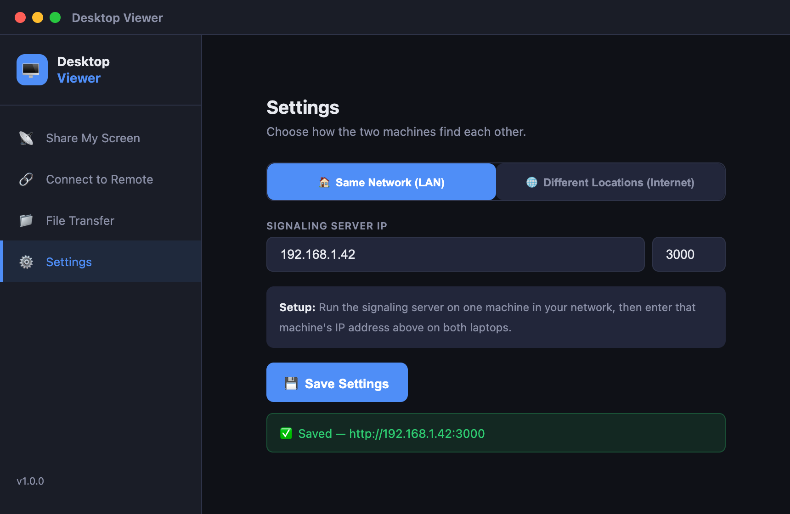
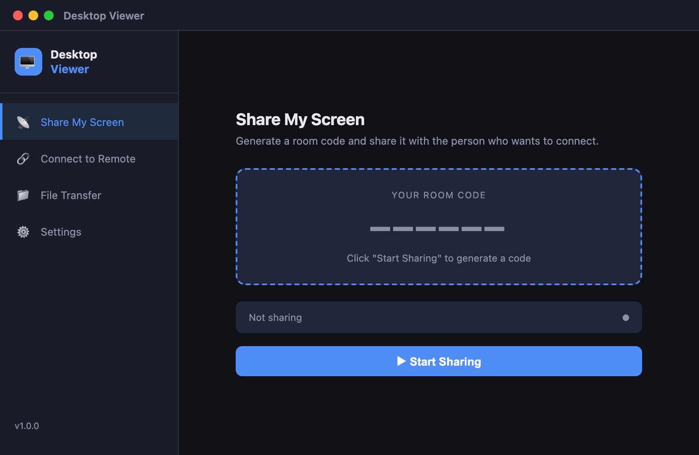
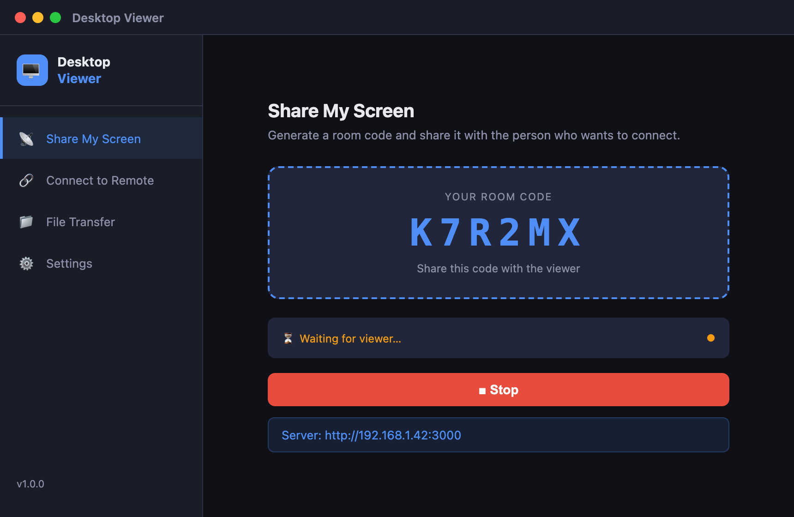
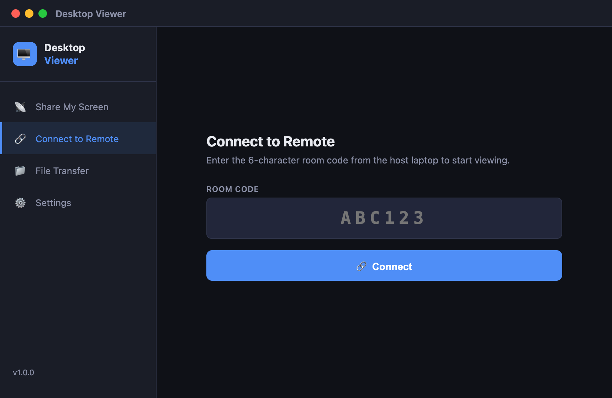
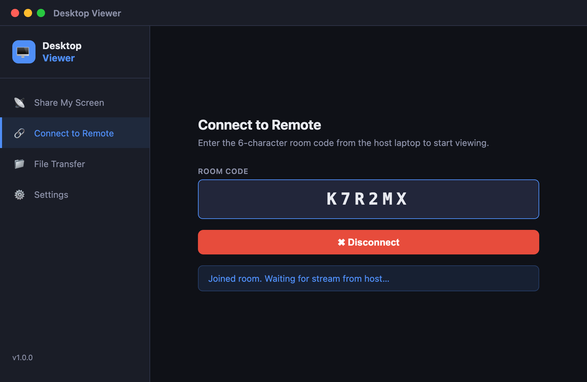
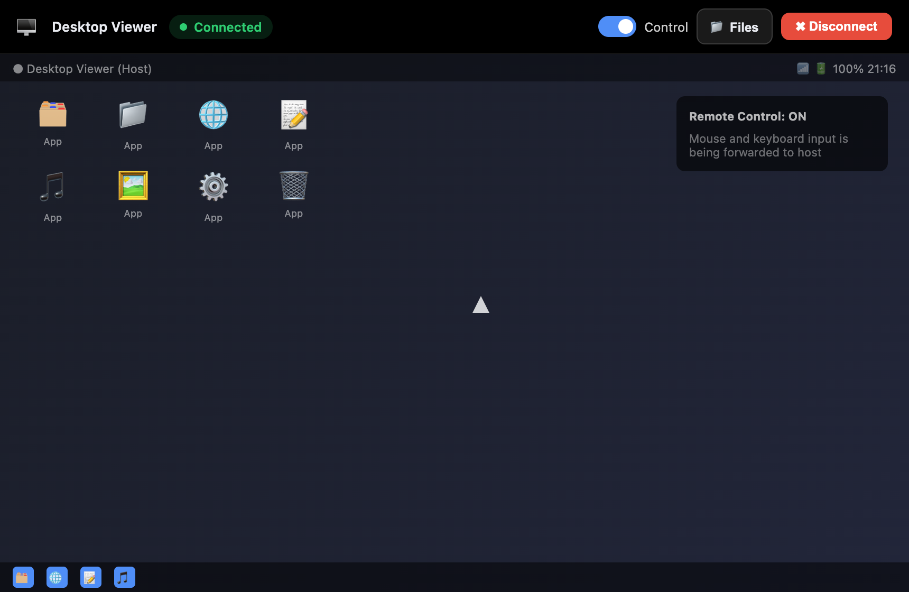
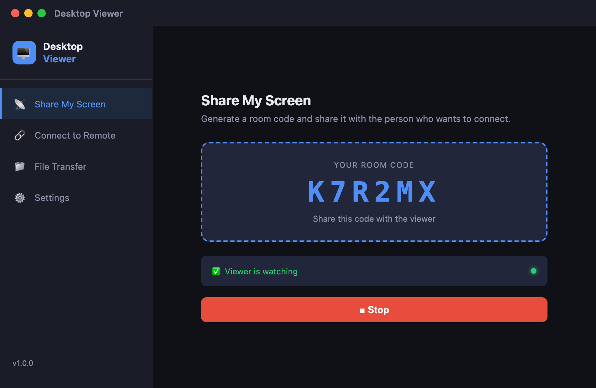
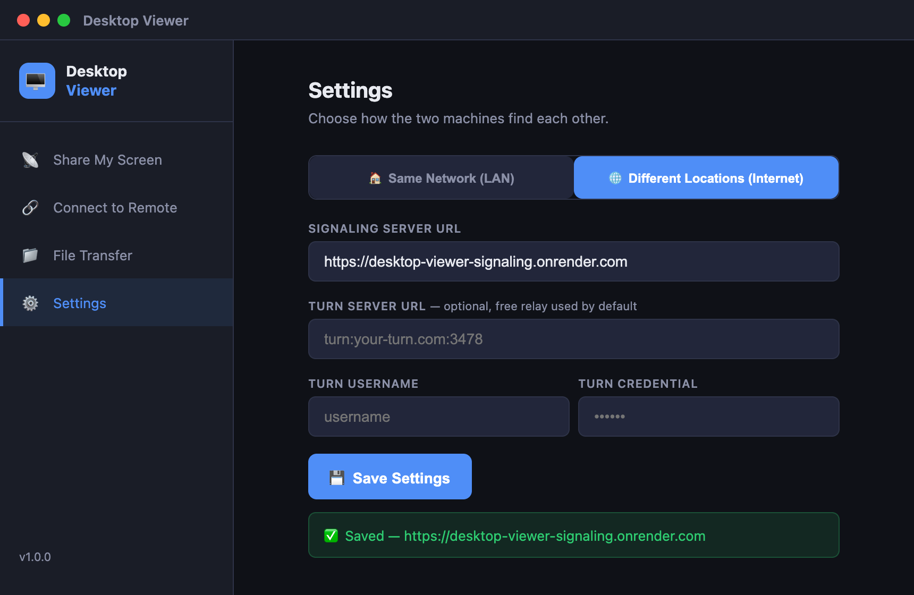
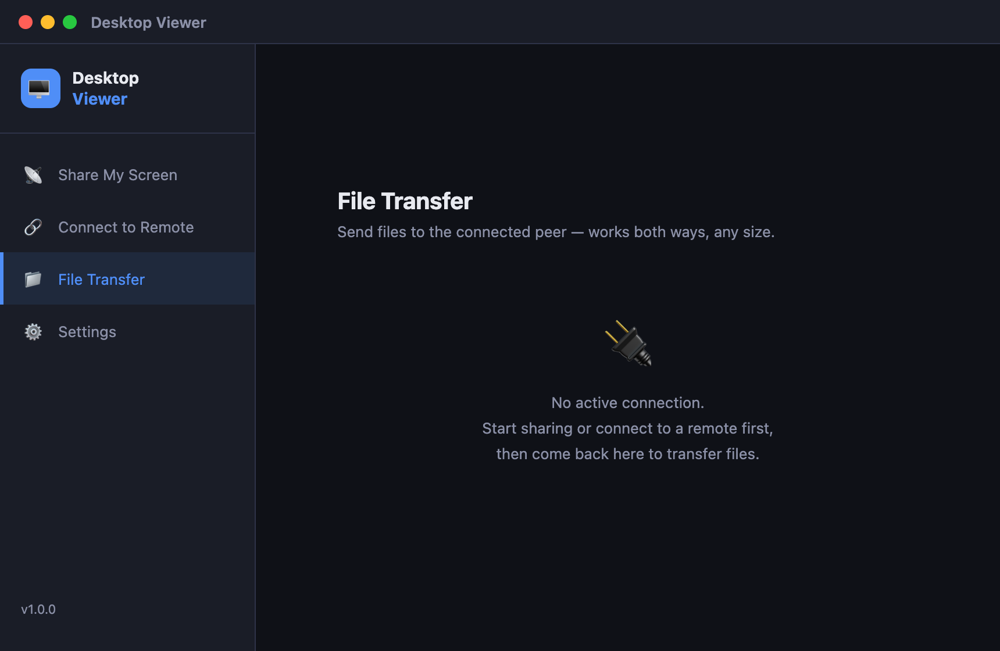
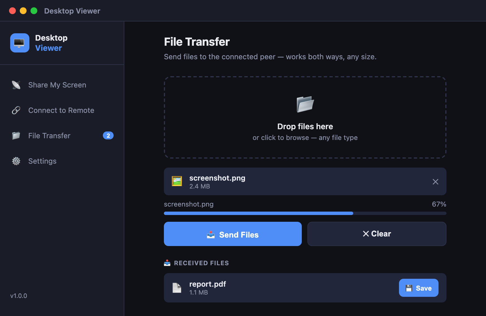

<div align="center">
  
  <h1>Desktop Viewer</h1>
  <p><strong>AnyDesk-style remote desktop — screen share, full remote control, file transfer</strong><br/>
  Works on your local network <em>or</em> across the internet. No accounts. No cloud subscription. Just install and connect.</p>

  [](https://github.com/ShasidharReddy/Shasi-Desktop-viewer/releases/latest)
  [](https://github.com/ShasidharReddy/Shasi-Desktop-viewer/releases/latest)
  [](LICENSE)
  [](https://github.com/ShasidharReddy/Shasi-Desktop-viewer/actions)
</div>

---

## ⬇️ Download & Install

Go to the **[Releases page](https://github.com/ShasidharReddy/Shasi-Desktop-viewer/releases/latest)** and pick your file:

| Your machine | File to download | How to install |
|---|---|---|
| 🍎 **macOS Apple Silicon** (M1 / M2 / M3 / M4) | `Desktop.Viewer-x.x.x-arm64.dmg` | Open DMG → drag app to Applications |
| 🍎 **macOS Intel** (2019 or older) | `Desktop.Viewer-x.x.x.dmg` | Open DMG → drag app to Applications |
| 🪟 **Windows 10 / 11** (64-bit) | `Desktop.Viewer.Setup.x.x.x.exe` | Double-click → Next → Install |

> **⚠️ First-run warnings are normal** — the app is open-source and unsigned.
> - **macOS:** Right-click the app → **Open** → **Open Anyway**
> - **Windows:** Click **More info** → **Run anyway**

---

## ✨ Features

| Feature | Details |
|---|---|
| 📡 **Screen Share** | Stream your full desktop to another machine over WebRTC P2P |
| 🖱️ **Remote Control** | Viewer controls host's mouse, keyboard, scroll — full AnyDesk-style control |
| 📁 **File Transfer** | Drag & drop files to send. Any file type, any size. Save with one click |
| 🏠 **Same Network** | Zero-config mode — just share a 6-char code on the same Wi-Fi |
| 🌐 **Cross-Region** | Internet mode — connect across cities, countries, VPNs, corporate NAT |
| 🔒 **Private** | Direct WebRTC peer-to-peer after handshake — no data stored |
| 🖥️ **Cross-platform** | Mac ↔ Mac, Windows ↔ Windows, Mac ↔ Windows |

---

## 🗺️ Choose Your Mode

| | 🏠 Same Network | 🌐 Different Locations |
|---|---|---|
| **Use when** | Both machines on same Wi-Fi / LAN | Different cities, countries, or networks |
| **Signaling server** | Run locally (takes 30 seconds) | Deploy to cloud (Render/Railway — free) |
| **Extra setup** | None | Paste the cloud server URL in Settings |
| **NAT traversal** | STUN (direct P2P) | TURN relay (auto-enabled) |

---

## 🏠 Mode 1: Same Network (Local LAN / Wi-Fi)

Both machines must be on the **same Wi-Fi or wired network**.

### Step 1 — Start the Signaling Server

Run this **once**, on **either** machine:

```bash
cd signaling-server
npm install      # first time only
npm start
```

You'll see:
```
=== Desktop Viewer Signaling Server ===
  Local:   http://localhost:3000
  Network: http://192.168.1.42:3000   ← write this down
```

> Keep this terminal open the whole session.

---

### Step 2 — Configure Settings on Both Machines

On **both** machines, open Desktop Viewer → click **⚙️ Settings**:



1. Make sure the **🏠 Same Network** tab is selected
2. Enter the **IP address** shown by the server (e.g. `192.168.1.42`)
3. Enter **port** `3000`
4. Click **💾 Save Settings**

---

### Step 3 — Share Your Screen (Host Machine)

On the machine you want to share:

**3a.** Click **📡 Share My Screen** in the sidebar



**3b.** Click **▶ Start Sharing**



A **6-character room code** appears (e.g. `XK92AB`). Share this code with the other person.

---

### Step 4 — Connect from the Viewer Machine

**4a.** On the other machine, click **🔗 Connect to Remote**



**4b.** Type the 6-character code → click **🔗 Connect**



**4c.** The host's desktop appears full-screen



The top bar shows:
- **● Connected** — live status
- **Control ⬜** — click to enable mouse + keyboard takeover
- **📁 Files** — open file transfer side panel
- **✖** — disconnect and return to menu

---

### Step 5 — Confirm Connection on Host

Back on the host machine you'll see:



The status changes from *Waiting for viewer…* to **● Viewer Connected**.

---

## 🌐 Mode 2: Different Locations (Internet / Cross-Region)

Use this when machines are on **different networks** — different cities, countries, behind corporate firewalls, mobile data, VPN, etc.

### Step 1 — Deploy the Signaling Server to the Cloud (One-Time Setup)

You need a **public URL** for the signaling server. Three free options:

#### Option A — Render.com (easiest, always-on free tier)

1. Fork or clone this repo to your GitHub account
2. Go to [render.com](https://render.com) → **New Web Service**
3. Connect your GitHub repo → select `signaling-server` as the root directory
4. Render auto-detects `render.yaml` — just click **Create Web Service**
5. Wait ~2 min → you get a URL like `https://your-app.onrender.com`

[](https://render.com/deploy)

#### Option B — Railway.app (generous free tier)

```bash
# Install Railway CLI
npm install -g @railway/cli

# Login and deploy
railway login
cd signaling-server
railway up
```

Railway prints your URL: `https://your-app.up.railway.app`

#### Option C — Run on any VPS / server

```bash
# On your VPS (Ubuntu/Debian)
git clone https://github.com/ShasidharReddy/Shasi-Desktop-viewer.git
cd Shasi-Desktop-viewer/signaling-server
npm install
# Run with PM2 (keeps running after SSH disconnect)
npm install -g pm2
pm2 start server.js --name desktop-viewer
pm2 save
```

Open port 3000 in your firewall/security group. Your URL is `http://YOUR_VPS_IP:3000`.

#### Option D — Docker

```bash
cd signaling-server
docker build -t desktop-viewer-server .
docker run -d -p 3000:3000 --name dv-server desktop-viewer-server
```

---

### Step 2 — Configure Settings on Both Machines

On **both** machines, open Desktop Viewer → click **⚙️ Settings**:



1. Click the **🌐 Different Locations** tab
2. Paste the full server URL (e.g. `https://your-app.onrender.com`)
3. *(Optional)* Enter custom TURN server credentials if you have them — or leave blank to use the built-in free relay
4. Click **💾 Save Settings**

> **What is TURN?** For internet connections, direct P2P fails behind symmetric NAT (corporate networks, mobile). TURN relay bounces packets through a server. The app auto-uses `openrelay.metered.ca` (free) when in remote mode.

---

### Step 3 — Share, Connect, Control (Same as Mode 1)

Everything from Step 3 onwards is **identical** to Mode 1 — same 6-char code flow, same UI.

The only difference: traffic routes through the cloud signaling server + TURN relay instead of your local network.

---

## 📁 File Transfer

File transfer works once a session is active (either mode).

### From the Files Tab (Before Connecting)



*File transfer is available once a connection is established.*

### During an Active Session



1. Drag & drop files onto the drop zone, or click **📂 Drop files or click to browse**
2. Click **📤 Send Files**
3. Progress bar shows transfer status
4. The other side sees the file under **📥 Received Files** with a **💾 Save** button

### From Inside the Remote View

1. Click **📁 Files** in the top bar → side panel slides in
2. Drop or browse files → **📤 Send**
3. Files transfer in real time — both host and viewer can send

---

## 🔑 macOS Permissions (First Run Only)

macOS requires explicit permission on first use:

| Permission | Needed by | Where to grant |
|---|---|---|
| **Screen Recording** | Host machine | System Settings → Privacy & Security → Screen Recording |
| **Accessibility** | Host machine (for remote control to work) | System Settings → Privacy & Security → Accessibility |

The app shows a prompt with an **Open System Settings** button when either permission is missing. After granting, restart Desktop Viewer.

---

## 🏗️ Architecture

```
┌─────────────────────────────────────────────────────────┐
│                     Same Network Mode                   │
│                                                         │
│  HOST ──────────── Signaling Server ──────────── VIEWER │
│  (local)              (localhost)               (local) │
│       └───────── WebRTC P2P (direct) ──────────┘        │
└─────────────────────────────────────────────────────────┘

┌─────────────────────────────────────────────────────────┐
│                  Internet / Remote Mode                 │
│                                                         │
│  HOST ───── Cloud Signaling Server (Render/Railway) ────│
│             (WebSocket handshake only)           VIEWER │
│                                                         │
│  HOST ───── TURN Relay (openrelay.metered.ca) ── VIEWER │
│             (when direct P2P fails: corporate/mobile)   │
│                                                         │
│  HOST ═══════════ WebRTC P2P (if STUN works) ══ VIEWER  │
│             (direct when NAT allows it)                 │
└─────────────────────────────────────────────────────────┘
```

**Data flows:**

```
Screen video  →  WebRTC video track  →  Viewer display
Mouse/keyboard events  →  WebRTC data channel  →  Signaling server  →  HOST
File data  →  WebRTC data channel  →  chunked ArrayBuffer  →  receiver reconstructs
```

**Components:**

| Component | What it does |
|---|---|
| `signaling-server/server.js` | Node.js + Socket.io — relays SDP offer/answer & ICE candidates; forwards remote control events |
| `client/main.js` | Electron main process — window, screen capture permissions, mouse/keyboard injection via robotjs |
| `client/src/app.js` | All renderer logic — screen share, viewer, remote control, file transfer, settings, ICE/TURN config |
| `client/src/index.html` | App UI — sidebar nav with Share / Connect / Files / Settings views |

---

## 🔧 Build from Source

### Prerequisites

```bash
# macOS
brew install node

# Windows — download from https://nodejs.org (LTS, v18+)
```

### Run in Development

```bash
# Terminal 1 — signaling server
cd signaling-server && npm install && npm start

# Terminal 2 — Electron app (hot reload)
cd client && npm install && npm start
```

### Build Installers

```bash
cd client
npm run build:mac    # → dist/Desktop.Viewer-x.x.x.dmg (Intel + Apple Silicon)
npm run build:win    # → dist/Desktop.Viewer.Setup.x.x.x.exe
npm run build:all    # → both platforms
```

Output goes to `client/dist/`.

---

## 📁 Project Structure

```
Shasi-Desktop-viewer/
├── signaling-server/
│   ├── server.js             ← Express + Socket.io signaling server
│   ├── package.json
│   ├── Dockerfile            ← containerized deployment
│   ├── render.yaml           ← Render.com one-click deploy
│   └── railway.toml          ← Railway.app deploy config
│
├── client/
│   ├── package.json          ← electron-builder config
│   ├── main.js               ← Electron main: window, permissions, robotjs
│   ├── preload.js            ← Context bridge (main ↔ renderer)
│   ├── assets/
│   │   ├── icon.icns         ← macOS app icon (512×512 multi-size)
│   │   ├── icon.ico          ← Windows app icon (16–256px multi-size)
│   │   └── icon.png
│   └── src/
│       ├── index.html        ← App layout
│       ├── app.js            ← All renderer logic
│       └── style.css         ← Dark theme
│
├── docs/screenshots/         ← UI screenshots for this README
│
└── .github/workflows/
    └── build.yml             ← CI: auto-build DMG + EXE on git tag push
```

---

## 🛠️ Troubleshooting

### Connection Issues

| Problem | Solution |
|---|---|
| **"Cannot connect to signaling server"** | **Same Network:** Is `npm start` running? Are both machines on the same Wi-Fi? **Remote mode:** Is your cloud URL reachable? Try opening it in a browser — you should see `Desktop Viewer Signaling Server running` |
| **"Room not found"** | Double-check the 6-char code. Host must still be sharing (not clicked Stop) |
| **Connection never establishes (spinning)** | Behind symmetric NAT? Go to Settings → Different Locations mode and ensure TURN is configured. Or try a different network |
| **Works locally, fails across internet** | Enable Remote mode with the cloud signaling URL. TURN relay will be auto-enabled |

### Display Issues

| Problem | Solution |
|---|---|
| **Black screen on viewer** | macOS host: re-grant Screen Recording in System Settings → Privacy & Security → Screen Recording. Restart app |
| **Grey / frozen screen** | Click Stop on host, click Start again to restart the stream |
| **Laggy/choppy video** | Check network bandwidth. Same-LAN wired ethernet = best. Reduce host screen resolution if on slow internet |

### Remote Control Issues

| Problem | Solution |
|---|---|
| **Control toggle doesn't move mouse** | macOS: grant Accessibility in System Settings → Privacy. Windows: run app as Administrator |
| **Keyboard input not working** | Click inside the remote screen first (focus), then toggle Control on |
| **Mouse clicks off by display scaling** | macOS: both machines should use the same display scaling (Retina/non-Retina mix can cause offset) |

### File Transfer Issues

| Problem | Solution |
|---|---|
| **Send button disabled** | Connection must be established first (viewer must have joined) |
| **Transfer stuck at 0%** | Disconnect and reconnect — the data channel may have stalled |
| **Large file transfer very slow** | Expected over WebRTC. Files are chunked and sent over the data channel |

### Platform Issues

| Problem | Solution |
|---|---|
| **Windows Defender warning** | Click **More info** → **Run anyway** |
| **macOS "unidentified developer"** | Right-click app → **Open** → **Open Anyway** |
| **macOS permission banner keeps appearing** | Grant both Screen Recording AND Accessibility, then restart |
| **High CPU on host** | Normal during active screen capture. Minimize other apps or reduce screen resolution |

---

## ⚠️ Known Limitations

- **Audio not captured** — video/screen only (no microphone or system audio stream)
- **One viewer per session** — single 1:1 connection only
- **Mobile not supported** — desktop Electron app only (macOS + Windows)
- Free TURN relay (`openrelay.metered.ca`) may have rate limits under heavy use — use your own TURN server for production

---

## 🤝 Contributing

Pull requests welcome. For large changes, open an issue first.

```bash
git clone https://github.com/ShasidharReddy/Shasi-Desktop-viewer.git
cd Shasi-Desktop-viewer/client
npm install && npm start
```

---

<div align="center">
  Made with ❤️ by <a href="https://github.com/ShasidharReddy">ShasidharReddy</a>
</div>
